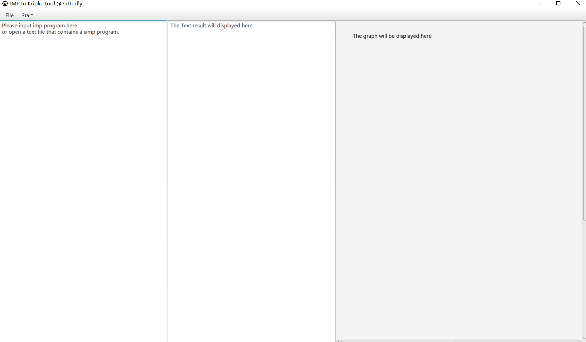

# IMP to Kripke toolkit
## A project from *System Analysis and Verification* course

*
 Interface 
*
### Basic Description:
* IMP Program : 
  Aexp a::=n|x|a0 + a1|a0 - a1|a0 * a1  n∈[0,2]  
  Bexp b::=true|false|a0 == a1|a0 <= a1|a0 >= a1| not b| b0 and b1| b0 or b1  
  Com  c::=cobegin P1||P2 coend  
       p::=skip;|x:=a|p0;p1|wait(b)|if b then p0 else p1| while b do p  
  The name of all variables are single lower letter  

* Instructions :  
  1.You may input an IMP Program in the left or select "open" in the "File" menubar to open a text file that contains an IMP program.  
  2.Select "BeginTransfer" in the "Start" menubar to start the translation.  
  3.The labelled program and first order logic formula and the Kripke structure will be shown in the middle. You may save the text locally by selecting "SaveText" in the "File" menubar. 
  4.The graph of the Kripke structure will be shown in the right. You may save the picture locally by selecting "SaveGraph" in the "File" menubar. 
* GUI framework : Javafx 
* JDK version : 14 
* Build automation tool : Maven  
### Build & Run
* Please Build this project with maven using "Install".
* After Building complete, please run instruction "java -jar SIMP_K_01-1.0-SNAPSHOT-jar-with-dependencies.jar" in cmd to start application.
* There is already a pre-built jar included in this repository, you can just run the instruction above to start the application